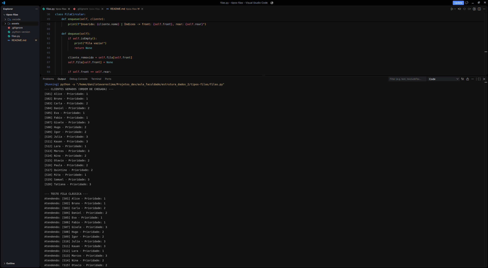
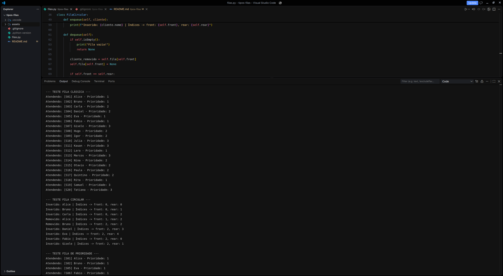
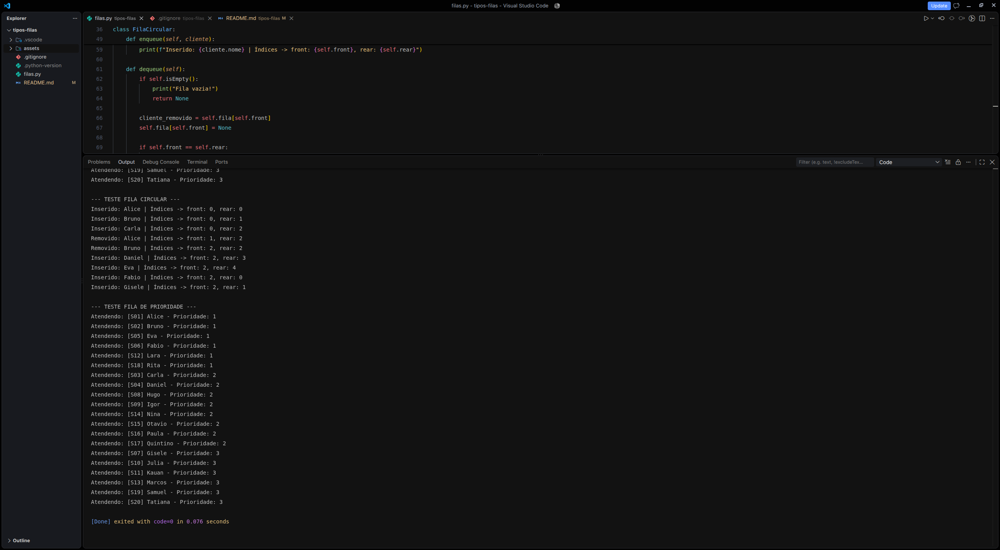

# Sistema de Atendimento com Filas

Simulação de um sistema de atendimento utilizando fila clássica (FIFO), fila circular e fila de prioridade em Python, com comparação entre as estruturas.

## Integrantes

- Danilo Tavares Lima — 43440924

## Como executar

Pré-requisitos: Python 3.x instalado (não há dependências externas — apenas biblioteca padrão).

```bash
git clone https://github.com/danilotavares-dev/fila-atendimento-hands-on.git
cd fila-atendimento-hands-on
python filas.py
```

## Estrutura do repositório

```
fila-atendimento-hands-on/
├── filas.py
├── assets/
└── README.md
```

## Explicação das implementações

### Parte 1 — Fila Clássica (FIFO)
A classe FilaClassica foi implementada utilizando a estrutura deque da biblioteca collections do Python. Isso garante complexidade de tempo O(1) nas operações de inserção (enqueue com append) e remoção (dequeue com popleft), tornando a estrutura altamente eficiente comparada a uma lista tradicional.

### Parte 2 — Fila Circular
A classe FilaCircular foi desenvolvida utilizando um array estático de tamanho fixo (5 posições). O controle das posições é feito pelos índices front e rear utilizando aritmética modular (ex: (self.rear + 1) % self.capacidade). Isso permite que, ao remover elementos do início, o índice rear dê a volta no array e reaproveite os espaços liberados, evitando desperdício de memória.

### Parte 3 — Fila de Prioridade
Implementada com o módulo heapq. Para garantir o critério de desempate (ordem de chegada para clientes com a mesma prioridade), os elementos foram armazenados em uma tupla estruturada como (prioridade, contador, cliente). O contador é incrementado manualmente a cada inserção, garantindo a estabilidade da fila sem erros de comparação de objetos.

## Desafio Final — Simulação com 20 clientes
O script principal gera automaticamente 20 instâncias da classe Cliente, atribuindo nomes e prioridades aleatórias (de 1 a 3). Em seguida, esses mesmos 20 clientes são processados sequencialmente pelas três estruturas construídas para demonstrar, na prática, a diferença de comportamento e escalonamento entre elas.

## Evidências dos testes

### Clientes Gerados



### Fila Clássica (FIFO)



A saída acima mostra a geração dos 20 clientes e o início do teste da fila clássica (visível também na screenshot seguinte). A ordem de atendimento é idêntica à ordem de chegada.

### Fila Circular


Esta captura mostra a continuação da fila clássica e o teste completo da fila circular. Após a remoção de Alice e Bruno, as posições 0 e 1 são reaproveitadas por Fabio e Gisele.

### Fila de Prioridade



A captura final mostra o teste completo da fila de prioridade, com os clientes agrupados por prioridade (1 → 2 → 3).

## Perguntas e Respostas

### 1. Por que a ordem de atendimento da fila de prioridade pode ser diferente da ordem da fila clássica?

Na fila clássica (FIFO — First In, First Out), o único critério de atendimento é a ordem de chegada. Na fila de prioridade, a estrutura reorganiza os elementos com base no grau de importância ou urgência definido (no caso do exercício, de 1 a 3). A ordem de chegada só é levada em consideração como critério de desempate quando dois elementos possuem o mesmo nível de prioridade — no nosso `heapq`, isso é garantido pelo campo `contador` na tupla `(prioridade, contador, cliente)`, que preserva a sequência original entre elementos de mesma prioridade.

### 2. Em quais situações reais uma fila de prioridade seria mais adequada?

Ela é essencial em sistemas onde o atraso no processamento de certos eventos pode causar impactos críticos. Exemplos incluem:

- **Saúde:** triagem em prontos-socorros, onde pacientes com risco de morte são atendidos antes de casos leves.
- **Computação:** escalonamento de processos no sistema operacional, garantindo que tarefas críticas do kernel não travem por causa de aplicativos de usuário.
- **Redes:** roteadores priorizando pacotes de chamadas de voz e vídeo (VoIP) em relação a downloads de arquivos, evitando latência e falhas na comunicação.
- **Atendimento ao público:** caixas preferenciais em bancos para idosos ou pessoas com deficiência.

### 3. Quais são as vantagens e limitações de uma fila circular?

**Vantagens:** otimização do uso de memória em arrays de tamanho fixo. Ao remover elementos do início da fila, as posições ficam vazias, e a fila circular consegue reaproveitar esses espaços fazendo o índice final (`rear`) "dar a volta" no array, sem precisar deslocar todos os outros elementos uma posição para frente.

**Limitações:** o tamanho máximo é estático e predefinido — uma vez atingida a capacidade total, a estrutura não cresce dinamicamente como uma lista encadeada. Além disso, o controle lógico dos ponteiros usando aritmética modular é mais suscetível a erros de implementação.

### 4. O que acontece ao tentar inserir um elemento em uma fila circular cheia?

Ocorre uma condição de overflow (transbordamento). A estrutura identifica que a próxima posição a ser preenchida pelo `rear` colidiria com o `front`, indicando que todos os espaços estão ocupados com elementos ainda não processados. A operação de inserção é bloqueada/rejeitada para não sobrescrever dados pendentes.
